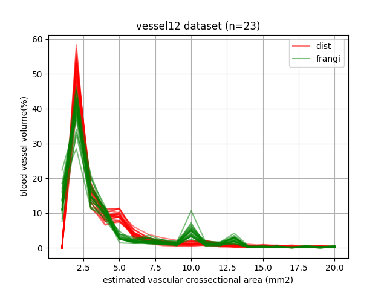

# published methods for computing BV5 or PVV5 can be lumped to the below few categories.

+ euclidean distance transform from binary vessel mask - distance transformed values at skeletonized locations can be used to estaimate radius. (ref https://www.ncbi.nlm.nih.gov/pmc/articles/PMC10023743 https://www.ncbi.nlm.nih.gov/pmc/articles/PMC7308498 )

    + implementation: see `pvv_dist.py`
    
    + this method will be referred to `dist` in below.

+ radius can be estimated using Frangi's multi-scale vesselness filter (ref https://link.springer.com/chapter/10.1007/bfb0056195 , https://www.sciencedirect.com/science/article/pii/S107731420090866X , Quantification of pulmonary vessel
diameter in low-dose CT images  https://doi.org/10.1117/12.2081602 )

    + note we compute vesselness from binary mask, since vessel segmentation is already obtained.  if you actually want to compute vesselnessness from original chest ct image, alpha,beta,gamma,denoising needs to be tweaked - expect argmax to be noisy.
    
    + implementation: see `pvv_frangi.py`

    + this method will be referred to `frangi` in below.

+ compute cross-sectional area from binary vessel mask from crossectional mask normal to vessel tangent (ref https://pubmed.ncbi.nlm.nih.gov/35334245) (`bcsa` in short)

    + work-in-progress implementation: see `pvv_fwhm.py`

+ compute cross-sectional by fitting 2d gaussian from crossectional image normal to vessel tangent. (`fwhm` in short)

    + work-in-progress implementation: see `pvv_fwhm.py`

+ scale-space-particle (ref https://www.ncbi.nlm.nih.gov/pmc/articles/PMC3670102)

+ vascular crossectional area estimated from axial slices of vascular masks. (for references see https://www.ncbi.nlm.nih.gov/pmc/articles/PMC10023743 )

+ radius can be derived also by assuming a length and fix radius per branch. (ref EA Chadwick — Vessel Network Extraction via micro-CT Imaging: A Foundation for Modelling Lung De- and Recellularization, see article for skeletn pruning methods, and branching/network analysis https://www.proquest.com/docview/2323128018 https://doi.org/10.1371/journal.pcbi.1008930 )


    + screenshot of comparing measurements using itksnap ruler tool and those derived from methods `dist` and `frangi`.


    + more screenshot of comparing measurements using itksnap ruler tool and those derived from methods `dist` and `frangi` for different vessel caliber.

        + manually measured radius 0.73mm (top left, diameter 1.46mm)
          radius from `dist`: 0.6mm (top right)
          cross-sectional area 1.31mm^2 (bottom left)
          category: PVV5 (bottom right)


        + manually measured radius 1.86mm (top left, diameter 3.739mm)
          radius from `dist`: 1.8mm (top right)
          cross-sectional area 8.97mm^2 (bottom left)
          category: PVV10 (bottom right)


        + manually measured radius 2.06mm (top left, diameter 5.124mm)
          radius from `dist`: 2.4mm (top right)
          cross-sectional area 15.23mm^2 (bottom left)
          category: PVV10 (bottom right)


        + vessel distribution, dataset VESSEL12 (n=12) compared to published data (Lins 2020)




# published BV values compared to above values.

    ### keywords used:

        + "bv5 bv10 pulmonary"
        + "blood vessel bv5 bv10"
        + "pvv5 pulmonary"


| method* | PVV5/TBV (%) | PVV10/TBV (%) | PVV10+/TBV (%) | sample size | link |
| -------- | ------- | ------- | ------- | ------- | ------- |
| dist  | 83.35 | 9.91 | 6.74 | vessel12, n=23 | NA |
| frangi | 78.87 | 11.18 | 9.95 | vessel12, n=23 | NA |
| dist ** | 2 | 11 | 85 | control, n=59 | [John 2023](https://www.ncbi.nlm.nih.gov/pmc/articles/PMC10023743) |
| bcsa | 57 | 20 | 23 | normal, n=107 | [Lins 2020](https://www.ncbi.nlm.nih.gov/pmc/articles/PMC7381940) |
| bcsa | 30 | 25 | 45 | covid negative, n=195 | [Morris 2021](https://www.ncbi.nlm.nih.gov/pmc/articles/PMC7908189) |
| bcsa | 18 | 71 | 11 | normal, n=248 | [Poletti 2022](https://pubmed.ncbi.nlm.nih.gov/35334245) |
| scale-space-particle | 58 | NA | NA | control, n=85 | [Estépar 2013](https://www.ncbi.nlm.nih.gov/pmc/articles/PMC3778757) |
| scale-space-particle | 62 | 12 | NA | normal, n=237 | [Samuel 2018](https://www.ncbi.nlm.nih.gov/pmc/articles/PMC6034125) |
| scale-space-particle | 58 | NA | 28 | normal, n=15 | [Rahaghi 2016](https://www.ncbi.nlm.nih.gov/pmc/articles/PMC4860553) |
| bcsa? | 63 | NA | NA | Gold1, n=166 | [Nam 2021](https://www.ncbi.nlm.nih.gov/pmc/articles/PMC8131193) |


`*`

```
dist : distance-transform
frangi : radius from max response of vesselness filter with varying sigma - computed from vessel mask
scale-space-particle : https://www.ncbi.nlm.nih.gov/pmc/articles/PMC3670102
```

`**`  hmmm?

<hr>

+ John, Joyce, et al. "Pulmonary vessel volume in idiopathic pulmonary fibrosis compared with healthy controls aged> 50 years." Scientific Reports 13.1 (2023): 4422.

https://www.ncbi.nlm.nih.gov/pmc/articles/PMC10023743

BV5/TBV: 2% , BV5-10/TBV:11% , BV>10/TBV:85% ( control, n=59 ) ??? OUTLIER VALUE!!

method summary: distance transform from binary vessel mask

+ Lins, Muriel, et al. "Assessment of small pulmonary blood vessels in COVID-19 patients using HRCT." Academic radiology 27.10 (2020): 1449-1455.

https://www.ncbi.nlm.nih.gov/pmc/articles/PMC7381940

BV5/TBV: 57% , BV5-10/TBV:20% , BV>10/TBV:23% ( normal, n=107 )

method summary: compute cross-sectional area from binary vessel mask

+ Morris, Michael F., et al. "Altered pulmonary blood volume distribution as a biomarker for predicting outcomes in COVID-19 disease." European Respiratory Journal 58.3 (2021).

https://www.ncbi.nlm.nih.gov/pmc/articles/PMC7908189/

BV5/TBV: 30%, BV5-10/TBV: 25%, BV10/TBV: 45% (covid negative, n=195)

method summary: compute cross-sectional area from binary vessel mask

+ Poletti, Julien, et al. "Automated lung vessel segmentation reveals blood vessel volume redistribution in viral pneumonia." European Journal of Radiology 150 (2022): 110259.

https://pubmed.ncbi.nlm.nih.gov/35334245

BV5/TBV: 18.4%, BV5-10/TBV: 70.8%, BV10/TBV: 10.8% (normal, n=248)

method summary: compute cross-sectional area from binary vessel mask

+ Estépar, Raúl San José, et al. "Computed tomographic measures of pulmonary vascular morphology in smokers and their clinical implications." American journal of respiratory and critical care medicine 188.2 (2013): 231-239.

https://www.ncbi.nlm.nih.gov/pmc/articles/PMC3778757

RLung BV5/TBV: 58% (n=85)

method summary: scale-space-particle (Chest Imaging Platform)

+ Ash, Samuel Y., et al. "Pruning of the pulmonary vasculature in asthma. The Severe Asthma Research Program (SARP) cohort." American journal of respiratory and critical care medicine 198.1 (2018): 39-50.

https://www.ncbi.nlm.nih.gov/pmc/articles/PMC6034125

BV<=5/TBV: 62% , BV<=10/TBV 74%  ( normal n=237)

method summary: scale-space-particle (Chest Imaging Platform)

+ Rahaghi, F. N., et al. "Pulmonary vascular morphology as an imaging biomarker in chronic thromboembolic pulmonary hypertension." Pulmonary circulation 6.1 (2016): 70-81.

https://www.ncbi.nlm.nih.gov/pmc/articles/PMC4860553

BV5/TBV 58% , BV>10/TBV 28% (normal, N = 15)

method summary: scale-space-particle (Chest Imaging Platform)

+ Nam, Ju Gang, et al. "Automatic pulmonary vessel segmentation on noncontrast chest CT: deep learning algorithm developed using spatiotemporally matched virtual noncontrast images and low-keV contrast-enhanced vessel maps." European Radiology 31.12 (2021): 9012-9021.

https://www.ncbi.nlm.nih.gov/pmc/articles/PMC8131193

PVV5/TBV 63% (Gold 1, n=166)

method summary: compute cross-sectional area from binary vessel mask?


#### using Vessel12 dataset we compute Blood-Volume-X BVX or Pulmonary-Vessel-like-Volume-X (PVVX)


+ we used TotalSementator to first segment the lung vessels.

+ method "pvvx-dt"
    + boundary-seeded distance-transform computed from vessel mask (bsfield)
    + vessel banch are identifeid and radius is estimated per branch.
        + by performing skeletonization from the vessel mask
        + identifying intersections from the vessel skeleton
        + once intersection points are removed, connected component can be performed to identify individual branch centerlines (each branch will have its own identifier).
        + per branch centerline, vessel radius can be estimated as the mean 
        value on the branch ceterline in the bsfield.
        + the branch identifier can then be watershd back into the vessel mask.
    + each branch can be assigned to be PVV5,5-10,10+ using the cross-sectional area computed from the estimated radius per branch.

+ method "pvvx-frangi" is similar except that the radius is estimated from the sigma of the max response from frangi's vesselness filter (objectness-filter in SimpleITK) - using the binary vessel mask.

+ WIP method "pvvx-bcsa" estimates the radius from the cross-sectional area at each vessel cross section normal to the vessel direction - using the binary vessel mask.

+ WIP method "pvvx-fwhm" estimates the radius from the cross-sectional area at each vessel cross section normal to the vessel direction - using the actual image - and fitting a 2d-gaussian to derive sigma_x,y, and sigmas are used to estimate radius.

```

mean pvv5-dist-prct 83.35 prct pvv5-frangi-prct 78.87 prct pvv5-bcsa-prct 55.18 prct pvv5-fwhm-prct 62.34 prct
mean pvv10-dist-prct 9.91 prct pvv10-frangi-prct 11.18 prct pvv10-bcsa-prct 38.28 prct pvv10-fwhm-prct 20.42 prct
mean pvv10+-dist-prct 6.74 prct pvv10+-frangi-prct 9.95 prct pvv10+-bcsa-prct 6.55 prct pvv10+-fwhm-prct 17.24 prct
mean pvv5-dist-cc 276.19 cc pvv5-frangi-cc 259.07 cc pvv5-bcsa-cc 176.47 cc pvv5-fwhm-cc 198.8 cc
mean pvv10-dist-cc 32.33 cc pvv10-frangi-cc 36.2 cc pvv10-bcsa-cc 124.02 cc pvv10-fwhm-cc 67.22 cc
mean pvv10+-dist-cc 22.3 cc pvv10+-frangi-cc 32.85 cc pvv10+-bcsa-cc 21.07 cc pvv10+-fwhm-cc 55.54 cc


n=23

```

<a href="test/viz.md">visualization of the resulting PVVX for Vessel12 dataset see </a>


## misc notes.

```

scale-space-particles

San Jose Estepar RRJ, Krissian K, Schultz T, Washko GR, Kindlmann GL.Computational vascular morphometry for the assessment of pulmonary vascular disease based on scale-space particles. In: Biomedical Imaging (ISBI), 2012 9th IEEE International Symposium on. IEEE; 2012. pp. 1479–1482
https://www.ncbi.nlm.nih.gov/pmc/articles/PMC3670102

https://pubmed.ncbi.nlm.nih.gov/23656466
https://www.atsjournals.org/doi/full/10.1164/rccm.201301-0162OC
https://www.atsjournals.org/doi/suppl/10.1164/rccm.201301-0162OC?role=tab
http://people.cs.uchicago.edu/~glk/ssp

https://github.com/acil-bwh/ChestImagingPlatform/issues/34

docker pull acilbwh/chestimagingplatform:1.5


+ distance transform

https://www.nature.com/articles/s41598-023-31470-6


+ hessian vesselness 

https://www.ncbi.nlm.nih.gov/pmc/articles/PMC7381940

pvv_frangi.py

```

```


area = pi*r^2

area 5 mm^2 , r = np.sqrt(5/np.pi) = 1.26 mm

area 10 mm^2 , r = np.sqrt(10/np.pi) = 1.78

if voxel width is .6 mm^3  (BV5)

|1|   radius ~ 0.5*0.6  = 0.3mm  (BV5)

|1|1| radius ~ 1*0.6 = 0.6 mm  (BV5)

|1|2|1| radius ~ 1.5*0.6 = 0.9 mm (BV5)

|1|2|3|2|1| radius ~ 2.5*0.6 = 1.5 mm (BV5-10)

|1|2|3|4|3|2|1| radius ~ 3.5*0.6 = 2.1 mm (BV10+)


--

|1|   radius ~ 1*0.6   --> 

|1|1| radius ~ 1*0.6 = .6mm (BV5)

|1|2|1| radius ~ 2*0.6 = 1.2 mm (BV5)

|1|2|3|2|1| radius ~ 3*0.6 = 1.8 (BV5-10)

|1|2|3|4|3|2|1| radius ~ 4*0.6 = 2.4 mm (BV10+)


```

```

alternative skeletonization method

https://github.com/amy-tabb/CurveSkel-Tabb-Medeiros

https://github.com/amy-tabb/CurveSkel-Tabb-Medeiros-2018

```
