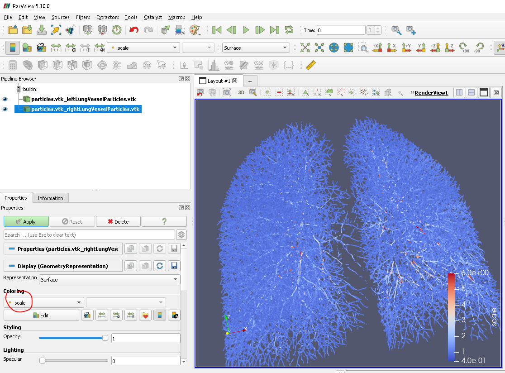

```

https://discourse.slicer.org/t/how-to-access-get-to-the-scale-space-particles-system/13675

https://groups.google.com/g/chestimagingplatform-users/c/KO68D66yt0o


```


```

docker pull acilbwh/chestimagingplatform:latest
docker build -t registry.cvib.ucla.edu/pteng:ssparticle .
docker push registry.cvib.ucla.edu/pteng:ssparticle

docker run -it \
    -u $(id -u):$(id -g) \
    -v /dingo_data:/dingo_data \
    -v /radraid:/radraid \
    -v /cvibraid:/cvisbraid \
    registry.cvib.ucla.edu/pteng:ssparticle bash

# find chest ct dicom images

ConvertDicom --dir dicom -o CT.nrrd
GenerateMedianFilteredImage -i CT.nrrd -o CT-median.nrrd
GeneratePartialLungLabelMap --ict CT-median.nrrd -o partialLungLabelMap.nrrd
python /ChestImagingPlatform/Scripts/cip_compute_vessel_particles.py -i CT.nrrd -l partialLungLabelMap.nrrd -r WholeLung -r LeftLung -r RightLung -o particles.vtk --perm -s 0.625 --tmpDir=$workdir


```





```

git clone https://github.com/acil-bwh/ChestImagingPlatform.git
cd ChestImagingPlatform
git checkout 7a4413f

```
```

docker build -t ssp:build -f Dockerfile.build .

docker run -it ssp:build bash

apt-get update && apt-get install git vim curl jq build-essential cmake -yq

docker run -it -v ${repo_path}:/opt/ChestImagingPlatform -w /opt/
ChestImagingPlatform ssp:build  bash

cd /opt/ChestImagingPlatform
mkdir ChestImagingPlatform-build
cd /opt/ChestImagingPlatform/ChestImagingPlatform-build

# in ../SuperBuild.cmake replace `ITK_VERSION_MAJOR 4`
with `ITK_VERSION_MAJOR 5`

# in ../SuperBuild.cmake replace
`set(${proj}_URL https://s3.amazonaws.com/acil/external_deps/boost_1_72_0.tar.gz)`
with `set(${proj}_URL https://boostorg.jfrog.io/artifactory/main/release/1.72.0/source/boost_1_72_0.tar.gz)`
    
# in lib-gitclone.cmake
replaced `set(git_protocol "git")` with `set(git_protocol "https")`

cmake ..
make -j 15

```