01: dist, frangi 

 02: dist, frangi 

 03: dist, frangi 

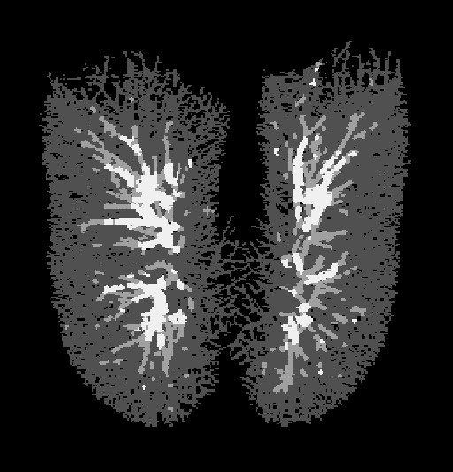
 04: dist, frangi 

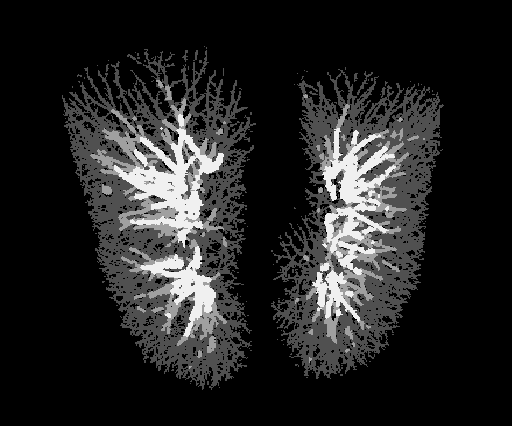
 05: dist, frangi 

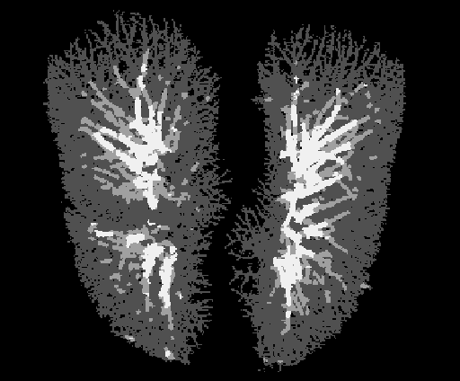
 06: dist, frangi 

 07: dist, frangi 

 08: dist, frangi 

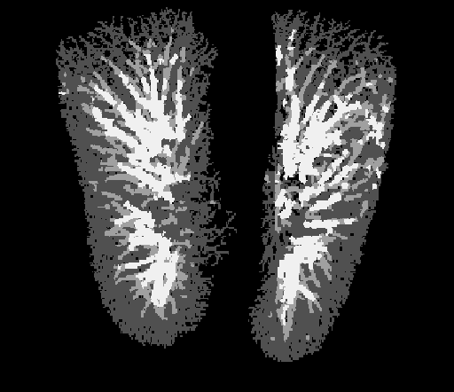
 09: dist, frangi 
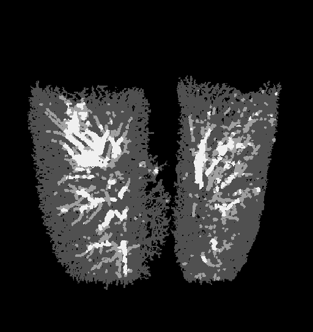
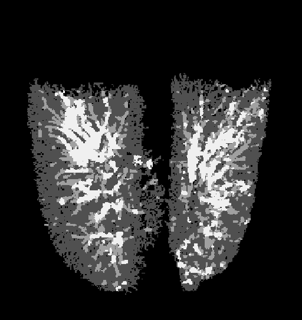
 10: dist, frangi 

 11: dist, frangi 

 12: dist, frangi 

 13: dist, frangi 

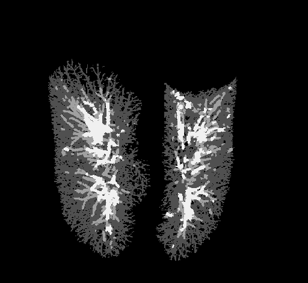
 14: dist, frangi 

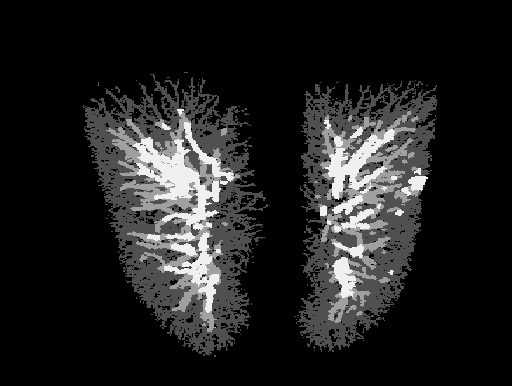
 15: dist, frangi 

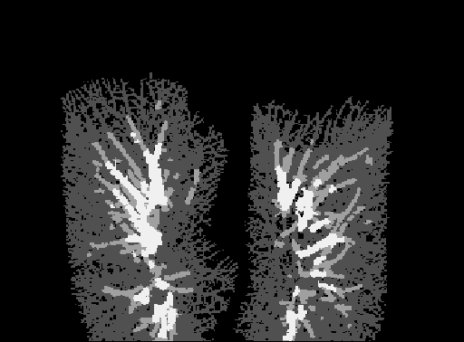
 16: dist, frangi 

 17: dist, frangi 

 18: dist, frangi 

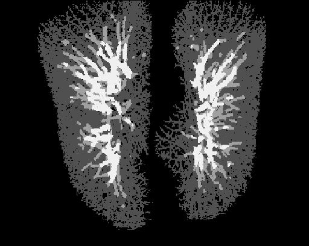
 19: dist, frangi 

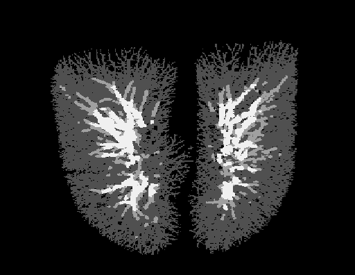
 20: dist, frangi 
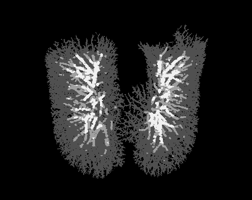
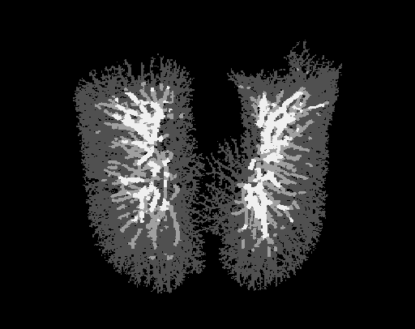
 21: dist, frangi 

 22: dist, frangi 
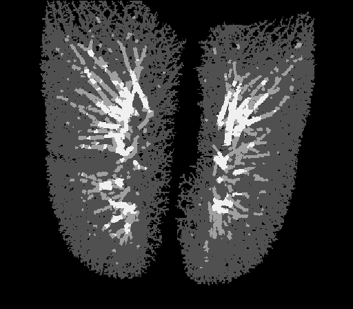
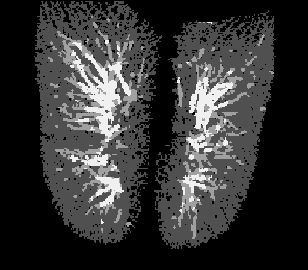
 23: dist, frangi 

 